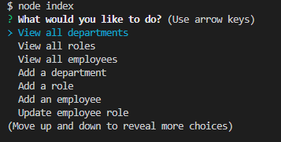
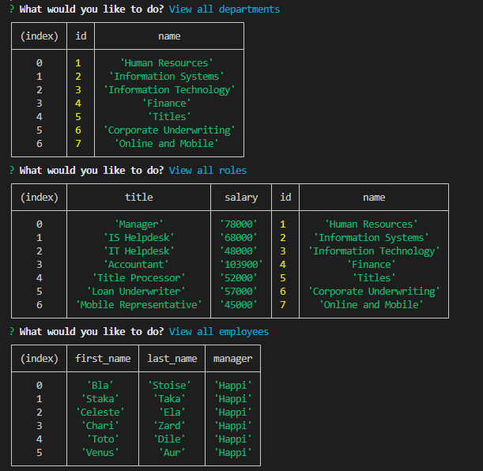

# Employee Tracker!
***
This is a nice little app using MYSQL and Inquirer to track your employees. Use this app to:  
- View and add your company's departments.
- View and add your company's roles.
- View and add newly hired employees.
- Update en employee's role when they get promoted.

***
## Prompts 

***

## Tables

***

## Installation

In order to use this app, open up your terminal and run "npm i" and then make sure to log into mysql and run "source schema.sql", finally run "node index" to run the prompts. Also feel free to use the existing seed file.

## [Application Demo](https://drive.google.com/file/d/1FSdJLp3MGcMxSPrel-Y4uxUeDQxxvzJp/view)

